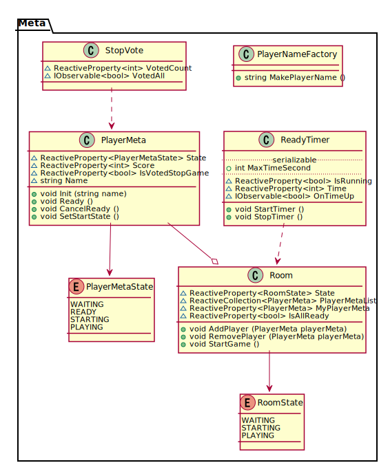

# クラス図

## 設計方針

ランキングやオプションは設計に含まないが、あとで組み込みやすいような設計にする。  
ModelはUIのことを知らない。UIがModelを購読してViewの処理をする。  
Start, Roby, Result は小規模なので適当に設計する。  

## 命名規則

- 複数形は”s”は使わず”List”を使う
- メンバはlowerCamelCase
- プロパティはUpperCamelCase
- namespaceやclassで複数形を使わない
- Abstractクラスは"Abstract"をPrefixとする
- Interfaceクラスは"I"をPrefixとする

## クラス図のルール

参考：[PlantUML \- クラス図 \| プログラマーズ雑記帳](http://yohshiy.blog.fc2.com/blog-entry-154.html#class_line)

### アクセス修飾子

- 〇 : public
- □ : private
- △ : private set; public get; なプロパティ、またはreadonly
- 中白はメンバ変数orプロパティ、塗りつぶしはメソッド

### 関係

- → : 利用（実線）。左が右を利用する。
- ..> : 依存（破線）。左が右に依存する。利用も含む。UniRxのイベント(IObservable)やReactivePropertyを購読（subcribe）する関係で使う。
- --▷ : 汎化（継承、実線）。左が右を汎化（継承）する。継承なら左が派生クラスで右が基底クラス。
- ..▷ : 実装（破線）。左が右を実装する。左が実装クラスで右はインターフェース。
- --◆ : コンポジション。左は右に集約される。左は右に強く依存する。
- --◇ : 集約。左は右に集約される。右が左のクラス・オブジェクトを複数持つ or 利用する。

### クラス記号

- C : Class
- A: Abstract Class
- I : Interface
- E : Enum

### その他

- serializable はUnityのInspectorViewでいじれる変数

## 詳細

### Namespace

### Scene

- Player作成やRoom入室はRobySceneで行う。
- StartSceneではRoomから抜けた状態。

### Meta

- ゲームシーンの外にあるが、ゲームに間接的に関わるクラスを持つ。

### GameMeta

- ゲームシーンの中で物理的には存在しない概念的なクラスを持つ。

### Game

- Game はゲームシーンで物理的に存在するクラスとその周辺クラス（UnityのGameObjectに割り当てられるようなもの）を持つ。
- Fruitの移動は複雑なのでMoveクラスで管理する。  
    - BaseMoveは単純な移動として実装し、開発初期はこれを使う。  
    - 回転やジクザグ、ワープなどの移動はBaseMoveクラスを継承して実装し、各FruitクラスのmoveControllerに割り当てる。

### UI

- 各オブジェクトを購読してUI表示を変更する。

### Input

- ユーザの操作関係を制御する。
- UnityのInputManagerも利用する。
- できればここで閉じ込めたいが、複雑になる場合は無理しなくても良い。
      
### Sound

- 各オブジェクトの購読して音を鳴らす。

### その他
- Input関係、よくわからんので気合いで頑張る
    - 調査後に設計に加えるかもしれない
- Game.PlayerはゲームシーンでPlayerのGameObjectに割り当てられるクラスだが、
Meta.PlayerMetaは本ゲームをプレイするプレイヤーの情報を管理するクラスである。
また、Game.PlayerはGameScene内のみでしか使われないが、Meta.PlayerMetaは他のシーンでも使われる。
